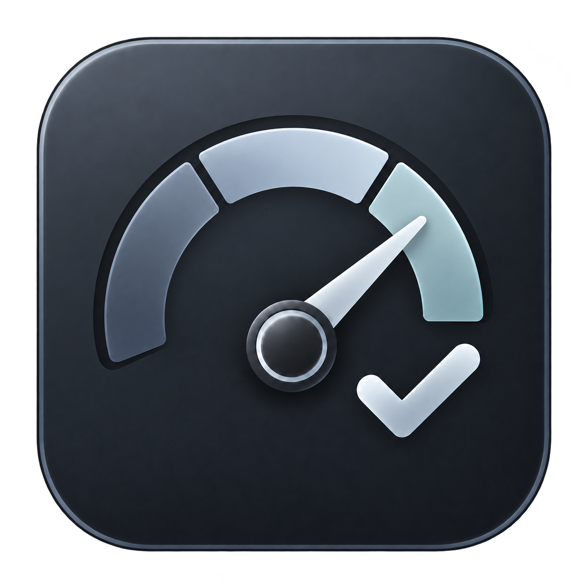
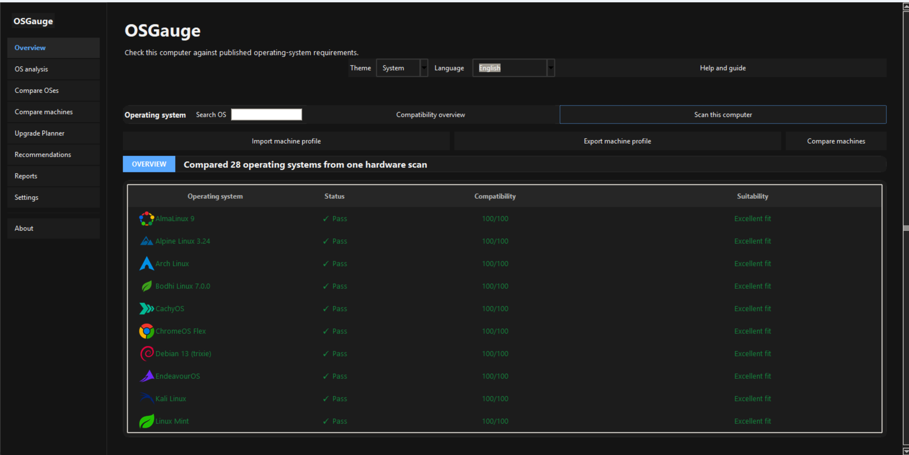
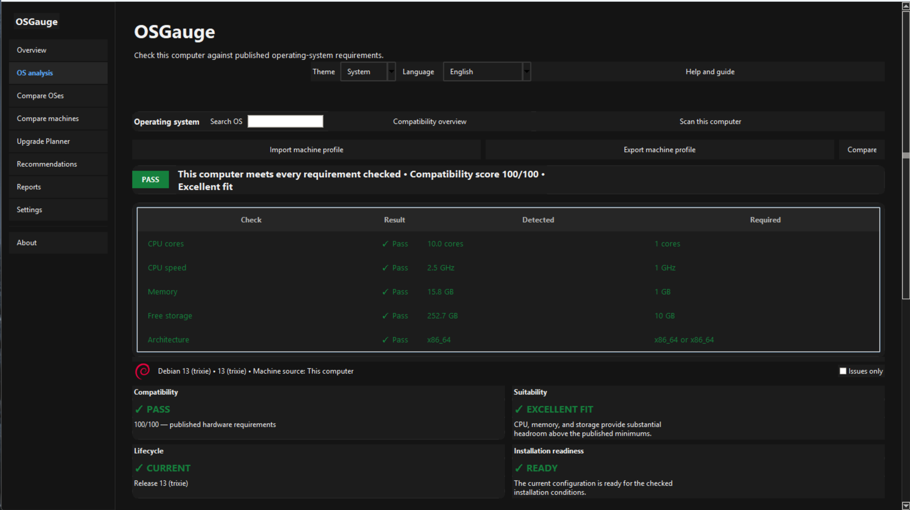
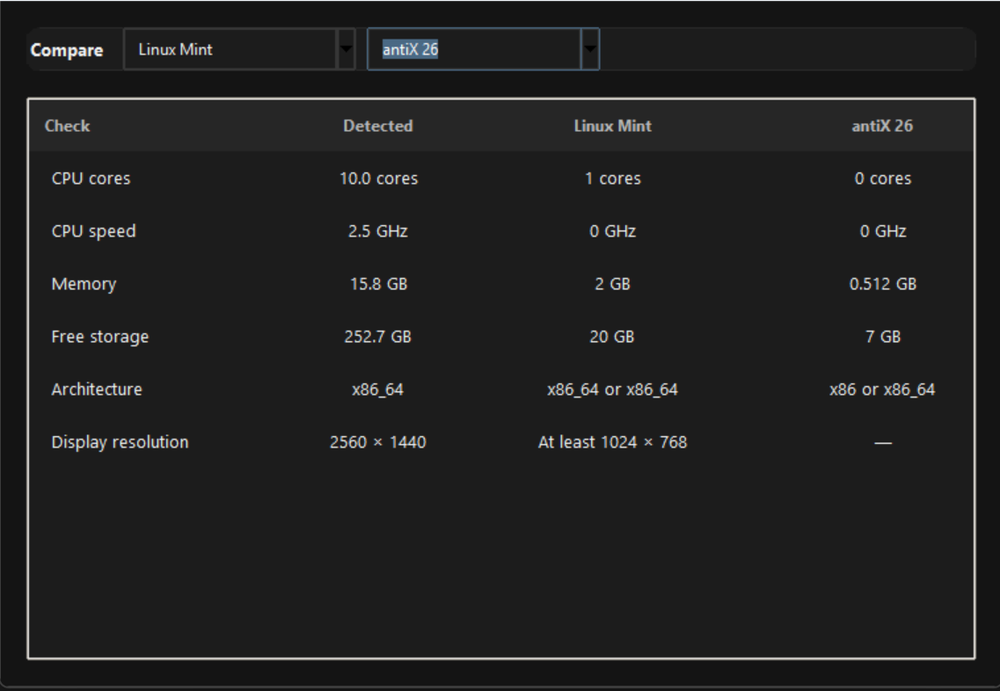
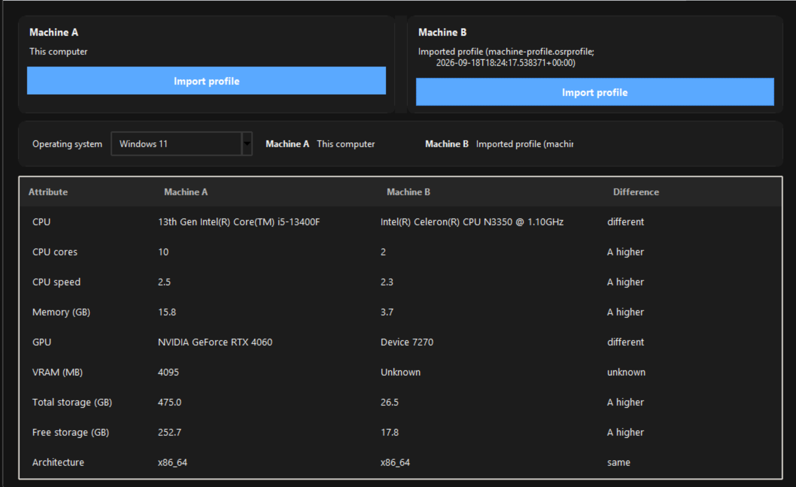
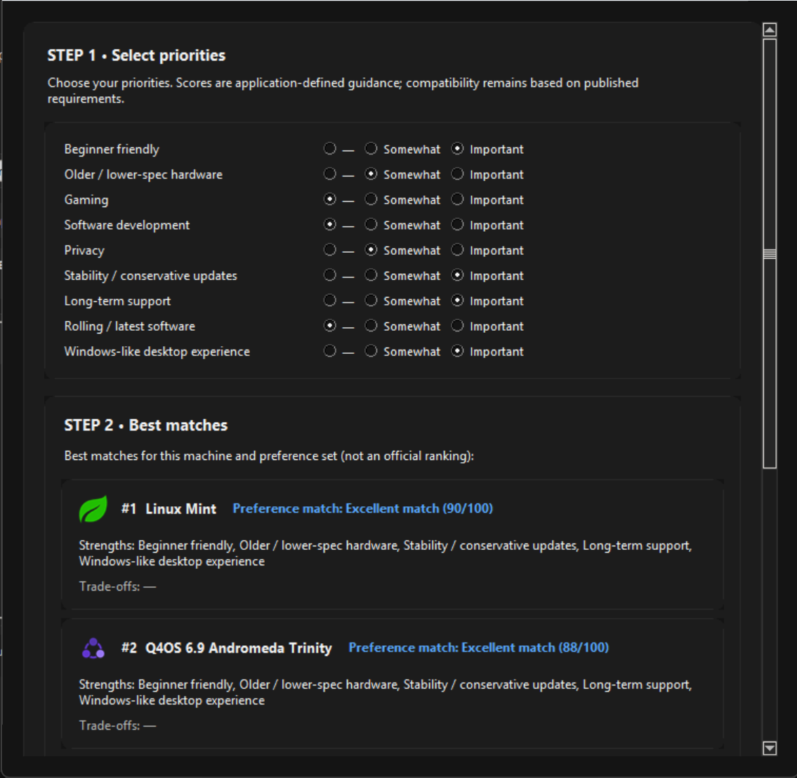
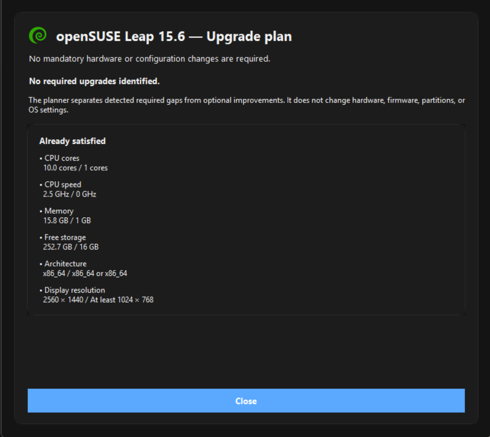

<p align="center">
  
</p>


<h1 align="center">OSGauge</h1>


<p align="center"><strong>Know what your PC can run.</strong><br>Cross-platform OS compatibility and readiness checker for Windows and Linux.</p>


<p align="center">
  <a href="https://github.com/sage-yeti/OSGauge/releases/latest"></a>
  <a href="https://github.com/sage-yeti/OSGauge/releases/latest"></a>
</p>


<p align="center">
  <a href="https://github.com/sage-yeti/OSGauge/releases"></a>
  <a href="https://github.com/sage-yeti/OSGauge/actions/workflows/build.yml"></a>
  <a href="https://github.com/sage-yeti/OSGauge/blob/main/LICENSE"></a>
</p>


Check whether an older or current PC can run a chosen Windows or Linux distribution before spending time installing it.


<p align="center"></p>


OSGauge scans the current machine locally, compares detected hardware with published operating-system requirements, and evaluates many systems from one scan. It keeps four ideas separate: compatibility, application-generated suitability guidance, lifecycle status, and installation readiness. Profiles, comparisons, recommendations, upgrade planning, and report export make the results useful beyond a single scan.


## Core concepts


- **Compatibility** — checks published hardware requirements.
- **Suitability** — estimates application-defined hardware headroom; it is guidance, not a vendor rating.
- **Lifecycle** — reports release and support status separately from hardware compatibility.
- **Installation readiness** — checks relevant current-machine configuration for installation.


## Features


- One hardware scan with compatibility results for 28 OS profiles.
- OS search/autocomplete, compatibility scoring, suitability, lifecycle, and installation-readiness views.
- Recommend an OS, compare operating systems, and compare machines with portable profiles.
- Read-only Upgrade Planner for required gaps and optional improvements.
- JSON/HTML report export and compact copy-to-clipboard summaries.
- Validated remote requirements updates with cache and offline fallback.
- Light, Dark, and System themes.
- GUI and CLI builds for Windows and Linux, plus AppImage and Flatpak.
- Local-first hardware scanning; machine profiles are data, not executable code.
- Ten UI languages with System locale detection.


## Screenshots


<table>
  <tr>
    <td><strong>OS Analysis</strong><br></td>
    <td><strong>Compare operating systems</strong><br></td>
  </tr>
  <tr>
    <td><strong>Compare machines</strong><br></td>
    <td><strong>Recommendations</strong><br></td>
  </tr>
  <tr>
    <td><strong>Upgrade Planner</strong><br></td>
    <td></td>
  </tr>
</table>


## Supported operating systems


The current requirements database contains 28 profiles. Requirements are based on linked official or published sources; names are not a quality ranking.


**Mainstream and desktop:** Windows 11, Ubuntu Desktop, Fedora Workstation, Arch Linux, Linux Mint, openSUSE Leap, Pop!_OS, Debian, ChromeOS Flex, Zorin OS, elementary OS, Manjaro.


**Specialist and enterprise:** Kali Linux, Tails, MX Linux, Rocky Linux, AlmaLinux, NixOS.


**Rolling, lightweight, and advanced:** EndeavourOS, CachyOS, Void Linux, antiX, Q4OS Trinity, Bodhi Linux, SparkyLinux MinimalGUI, Slax, Alpine Linux, Tiny Core Linux.


## Languages


English, Italiano, Español, Deutsch, Français, 简体中文, Русский, Türkçe, Português (Brasil), and Ελληνικά. **System** uses the detected locale when supported and otherwise falls back to English.


## Downloads


Download the latest stable artifacts from [GitHub Releases](https://github.com/sage-yeti/OSGauge/releases/latest). The normal distributables are:


- **Windows GUI:** `OSGauge-Windows-x64.exe`
- **Windows CLI:** `OSGauge-CLI-Windows-x64.exe`
- **Linux GUI:** `OSGauge-Linux-x64`
- **Linux CLI:** `OSGauge-CLI-Linux-x64`
- **AppImage:** `OSGauge-Linux-x86_64.AppImage`
- **Flatpak:** `OSGauge-Linux-x86_64.flatpak`


Packaged builds include the requirements database and do not require Python. Release downloads include `SHA256SUMS.txt` when a versioned release is published.


## Quick start


### GUI


1. Download the build for Windows or Linux.
2. Launch it and choose **Scan this computer**.
3. Search for or select an OS, then review compatibility, suitability, lifecycle, and installation readiness.


### CLI


Use the packaged CLI executable, or run `python cli.py` from source:


```text
OSGauge-CLI-Windows-x64.exe --list
OSGauge-CLI-Windows-x64.exe --check "Windows 11"
OSGauge-CLI-Windows-x64.exe --all --json --output readiness.json
```


On Linux, use the corresponding `OSGauge-CLI-Linux-x64` executable. `--help` lists all available options.


## Profiles and machine comparison


An `.osrprofile` is a portable snapshot of hardware and relevant configuration. It contains data only and no executable code. Profiles can be exported, imported, and re-evaluated against current requirements; importing a profile does not scan the local machine. **Compare Machines** can compare the current computer with an imported profile or compare two imported profiles.


## Privacy and offline behavior


Hardware scanning happens locally. Requirement updates are data-only, validated before use, and cached per user. Bundled or cached requirements remain usable offline. Profiles do not include usernames, hostnames, serial numbers, network data, keys, or personal files.


## Requirements sources and limits


OSGauge uses published or official hardware requirement sources where available. Compatibility is not a certification or a guarantee of driver, peripheral, firmware, or model-specific support. A Linux live environment can still be useful for verifying hardware before installation.


## Development


Python 3.10 or newer is expected for source use. The project uses the Python standard library at runtime; install `pytest` for the test suite.


```text
python -m pip install pytest
python app.py
python -m pytest
python -m compileall .
```


The packaged builds are produced by GitHub Actions with PyInstaller. AppImage and Flatpak packaging instructions are kept in `packaging/`.


## License


OSGauge is released under the [MIT License](https://github.com/sage-yeti/OSGauge/blob/main/LICENSE).
